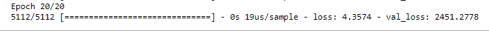
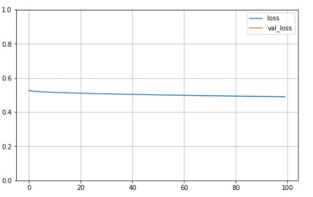
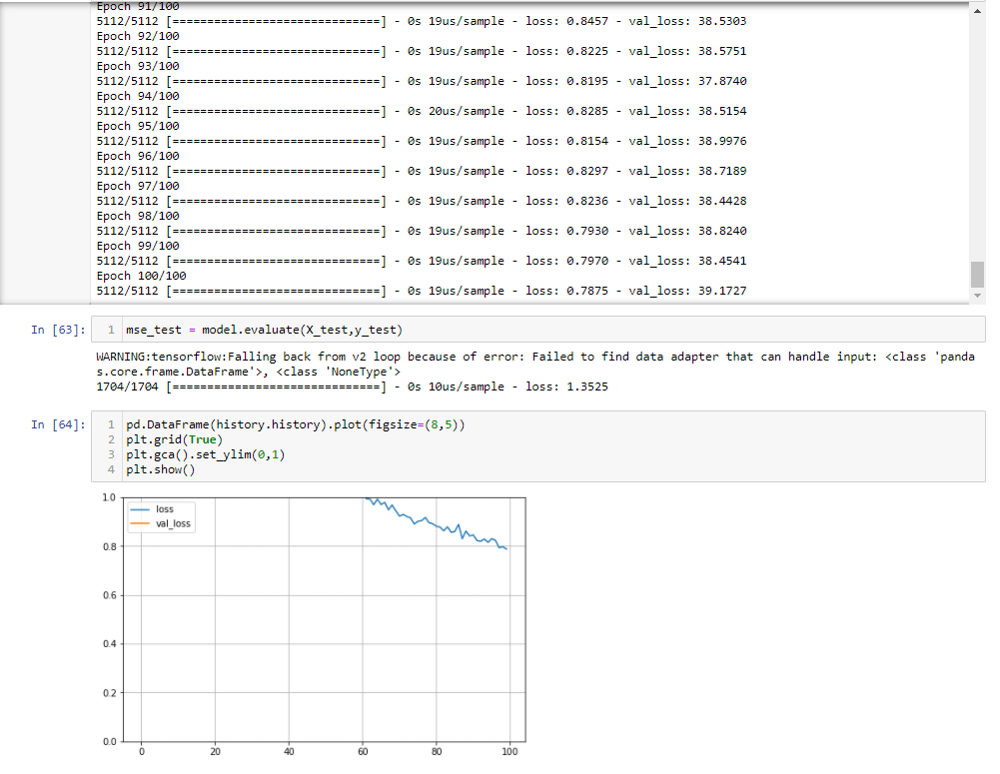

# Machine-Learning-for-Stock-Prices
For my senior design project at Miami University my team and I set out to try and develop a machine learning algorithm to advise and make stock investments. There were many parameters to consider such as investment amount, length, amount of risk, as well as how we measure that risk and determine probability of profit.
## Table of Contents
**[Introduction](#Introduction)** 
**[Machine Learning Overview](#Machine-learning)** 
**[Our Goal](#Our-Goal)** 
**[Tools](#Tools)** 
**[Programming](#Programming)** 

## Introduction

Ever since the stock market was founded, people have been trying to find a way to "beat" it. That is, correctly predict the future value to make a profitable investment. The stock market is essentially just an auction. Someone has a part of a company that they are willing to sell for a certain amount of money (ask price) and people want to buy that share for another amounr (ask price) and eventually the buyer wil buy at a price and that will become the new price for the stock. That is a very simple overview but with millions of transactions and millions of dollars going in and out of companies daily, it becomes hard to predict what the price will do. There is also a plethora of data ranging from stock charts to technical data such as moving averages or momentum oscillators. This data makes this problem a good starting point for a machine learning algorithm. This is an ongoing project and I will post updates here as they become available. I will also begin to upload code when it becomes available.

## Machine learning 

Machine learning algorithms learn through experiementation. This process is called training. A normal algorithm follows a certain set of rules. If this then do this, else do something else. A machine learning algorithm improve these steps by themselves so that humans do not have to constantly update the algorithm. Machine learning has two main categories: Classification and regression. Classification is used for sorting data into groups or bins. An example of this is spam detection. This algorithm is trained on labeled data (supervised learning) and when it sees a new email it can classify it as spam or not spam. Regression is good for predicting a future characteristic or attribute of data. This makes this method a great tool for predicting stock prices. As mentioned above supervised learning is when we train the machine learning algorithm with labeled data and then feed it data that is unlabeled. With the existence of supervised learning hints to the existence of unsupervised learning. Unsupervised learning is where we feed the algorithm data that is unlabeled in the training stage. This would be a good solution for our data because we don't have our data labeled however, regression relies on supervised learning. Thus, we will need to obtain some sort of labeled data or do some preprocessing ourselves to prep our data for the training stage. 

Above are the steps we will follow to create our machine learning model and implement it. Gathering and prepping the data will take the most time as we will be gathering raw data from the New York Stock Exchange (NYSE). We will get the price and volume and from that we will create the technical indicators that we want to use to make our predicitions. After we create those indicators we will need to normalize the data. This would take an extreamly long time and we would have to create multiple new files for each company but with Scikit-learn python library, we can easily complete this step with just a few lines of code. The last prepping step to do is to label the data. In this step we will have to determine our length of investment and then calculate if each price point is a profit or loss. After we are done prepping we get to choose the model that best fits our needs. As mentioned before we will start with a regression model and move on from there. One interesting avenue to go down would be to use a clustering model. Clustering models work really well with unsupervised data which is what we will have. There has been some research done in regards to unsupervised regression models, however the goal of this project is not to come up with a new model but to use an existing one to try and better predict stock prices.

## Our Goal

Our goal is to input historical stock data for a given stock ticker, and try and use this algorithm to tell us when to buy and sell the stock in order to reap the most rewards. As a benchmark we will use the S&P500 because that is the standard that most mutual funds and investors use when creating a new fund. Along with the input of the ticker, a user will enter the amount they are willing to invest and the risk level that they are comfortable with. The output of the algorithm is what we need to focus on in order to build a proper model. There are many ways in which we can construct this algorithm one of which is using all the investment money atonce to buy as much of the stock as we can and then sell all of it when we receive a sell signal from the machine learning model. However, we could have to algorithm invest only portions of the investment amount based on certainty of profit and then sell certain amounts based on certainty of loss. All these will have to be considered when constructing the model. For now we will focus on just predicting the price and we will use another algorithm on the output to calculate the risk level and chance of profit. 

## Tools

For this project we decided to use the python programming language. Python is one of the fastestgrowing programming languages in popularity because of its simplicity and use of white space (indentation). It also has many powerful libraries available to download. One such library that we will use to create, train and evaluate the model is the scikit-learn library. This library has many tools and allows the user to input data and has built in functions for spliting the data up into training and testing. Another pwoerful tool we will be using is the Pandas library. Pandas is a powerful data library that allows us to read, write and organize excel files, csv files and many other data types. It comes preloaded with many unique tools that allow us to see null values, data types in each feature and many more. 
For our IDE I chose IDLE and Jupyter Notebook. Both of these IDEs have their pros and cons, but I especially like Jupyter because I can run cell by cell to see outputs and gain a deeper understanding of my code.

## Programming 

There are many different types of models and methods to build a successful machine learning algorithm. As mentioned above classification and regression are the two methods that machine learning performs really well. So for the first few trials of programming, I attempted to make a regression algorithm. This is because the goal is to predict future stock prices. I had limited success with this. I created about four different models and only two gave me results that were remotley acceptable. The first models results are below. As you can see, by the end of the short training period I was able to acheive an accpectable loss but not an accecpt able value loss. For this model I used an input layer of 27 neurons, a hidden layer of 15 neurons and an output layer of 1 neuron. For both models I used an activation function of sigmoid on all layers and an optimizer function of sgd on the weights. 

The next trial I conducted was changing the input data to only price and volume. For the above model I trained it using a plethora of technical data compiled in the excel sheet. However, since the technical indicators are already made from price and volume data, presenting a model with the technical data could lead to overtraining since it will have seen the data again just transformed. Those results were not much better.

As you can see, the loss is well under 1 (very acceptable) but loss and accuracy are nowhere on the charts. The loss isn't there because the value is too high (in the 1000s) but accuracy isn't there for an unknown reason. Possibly an error in the code. 

After these unpleasant results I did a little more research in predicting values (stock prices) with machine learning. After that I decided to tweak my original model. Instead of having a different amounts of neurons per layer, I made all hidden layers have 15 neurons (choosen at random). I kept the same activation and optimization functions as the previous tests and wound up with much more pleasant result. 

These results started with a high loss but eventually made it to under 1 which was good. The value loss is still really high and accuracy is still not on the chart but I will tackle one issue at a time. 

The next three trials will be the following: 
1. Tweak parameters of current model 
2. Create a model using tensorflow.estimator instead of keras
3. Create a new dataset to run a classification model instead

You might be wondering why I would try and run a classification model on something designed to predict the output. Well, instead of thinking about predicting the price we can try and classify a datapoint based on future data. To do this I will add a few columns to the price and volume data set. Each of these columns will contain a 1 or a 0. It will contain a 1 if the price increase X% from a certain time period before and a 0 if it did not increase by that percentage. This way we can ask the user for their investment length and use that column of data to optimize the model. Then we feed the model the price and volume data and have it try and predict if it will be a 1 or a 0, thus a classification model. 

### Tweak parameters

For these next iterations of my model, I choose to simply tweak the parameters of the model I had created. These parameters are as follows: Number of layers, number of neurons per layer, activation function, using bias neurons, using kernal initializers, and optimization functions. Not only did I spend time tweaking these parameters but I sought help through the machine learning community on [stackoverflow](http://stackoverflow.com). There were a limited number of replies on my post regarding optimization of a model but I was able to take what was said and change a few things in order to get a model that seemed to work differently. Not necessarilly better, but something more understandable for a beginner. I changed the activation function to the popular ReLu function, and used it for all layers (except the output). Then used the 'adam' optimizer for backpropagation and I also changed the model dimensions. That is I changed it to be two layers with two neurons each and then an output layer with one neuron. I did this because I changed the input data set to only include price and volume (two features). This is because before I was dealing with 26 features. I thought that if I could get a model to work with data that was more simple, then I could try and work with more complex data afterwards. 
The results were mixed and I tried about a dozen different models but I still have two major problems. The first being overfitting. This is common and there are many reasons that a model would be overfit. Such as a model that is too complex, data that is not correctly normalized, or the absence of regularizers on the weights. The next problem is that my model doesn't reach the desired range for loss and validation loss. However, the validation loss doesn't increase which means that it is still technically learning but at a much slower rate. This is called the vanishing gradient problem. As models get larger and more complex, the gradients on the lower levels get smaller and smaller eventually ending up around zero. This problem I am still quite new to and will be the subject of further research as the project goes on.

If you have any comments or suggestions please feel free to email me at: bregolf98@gmail.com
